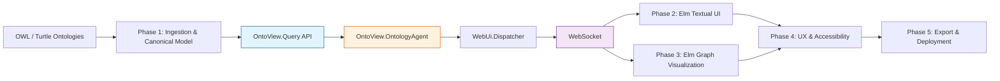
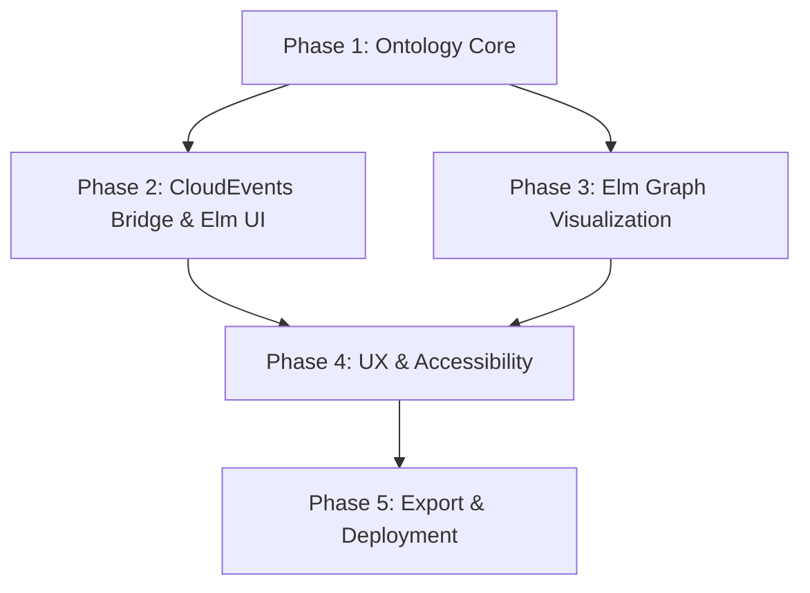
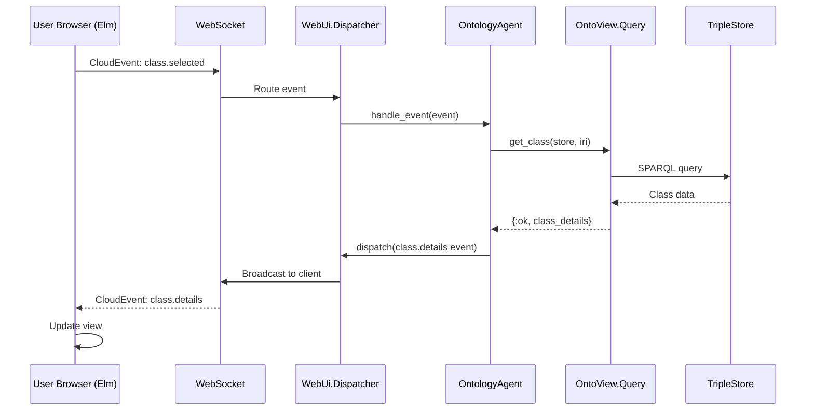

# Overview: Ontology Documentation Platform

> **ARCHITECTURE NOTE:** This document describes the **web_ui + CloudEvents + Elm SPA** architecture. The platform is currently **ON HOLD** until the `web_ui` library is completed.

------------------------------------------------------------------------

## Project Goals at a Glance

- Provide first-class, human-readable documentation for OWL ontologies
- Support live semantic exploration via **Elm SPA with CloudEvents**
- Offer both **textual accordion-based navigation** and **interactive graph visualization**
- Ensure full **accessibility (WCAG 2.1 AA)** and enterprise-grade deployment
- Enable long-term **ontology evolution, governance, and release management**

------------------------------------------------------------------------

## High-Level System Architecture



------------------------------------------------------------------------

## Phase Dependency Graph



------------------------------------------------------------------------

## Runtime Data Flow (CloudEvents)



------------------------------------------------------------------------

## Architecture Comparison

| Aspect | Original (Phoenix LiveView) | Revised (web_ui + Elm) |
|--------|----------------------------|------------------------|
| **UI Rendering** | Server-side HEEx templates | Client-side Elm SPA |
| **State Management** | LiveView assigns (server) | Elm Model (client) |
| **Communication** | WebSocket + LiveView protocol | WebSocket + CloudEvents |
| **Event Handling** | `handle_event` callbacks | CloudEvents dispatcher + agents |
| **Graph Visualization** | JS hooks + D3-like | Elm canvas + force-directed |
| **Widget Layer** | Phoenix.Component functions | Elm components (term_ui patterns) |

------------------------------------------------------------------------

## Phase Index

### Phase 1 --- Ontology Ingestion, Parsing & Canonical Model

**File:** `phase-01.md`

**Status:** NO CHANGES REQUIRED

**Purpose:** Establishes the full semantic parsing and canonical ontology query layer.

**Key Capabilities:**
- Recursive `owl:imports` resolution with TripleStore
- RDF triple normalization in named graphs
- OWL class, property, and individual extraction via SPARQL
- Class hierarchy and property relation modeling
- Canonical query API for UI and visualization layers

**Key Modules:**
- `OntoView.Loader` - Turtle file loading
- `OntoView.TripleStore` - TripleStore wrapper
- `OntoView.Query` - Canonical query facade
- `OntoView.Query.SPARQL.*` - SPARQL query modules

------------------------------------------------------------------------

### Phase 2 --- CloudEvents Bridge & Textual Documentation UI

**File:** `phase-02.md`

**Status:** MAJOR ARCHITECTURAL CHANGES

**Purpose:** Delivers the core user-facing ontology documentation interface using web_ui library.

**Key Capabilities:**
- CloudEvents bridge between Elm frontend and Elixir backend
- `OntoView.OntologyAgent` using `WebUi.Agent` behavior
- Elm SPA with routing, state management, and navigation
- Text-based UI with browsing, searching, and filtering

**Key Modules:**
- `OntoView.OntologyAgent` - Main event handler
- `OntoView.Endpoint` - Phoenix endpoint for web_ui
- `OntoView.CloudEvents` - Event type definitions
- Elm Pages: `ClassExplorer`, `ClassDetail`, `PropertyDetail`
- Elm Components: `TreeView`, `SearchInput`, `PropertyTable`

**CloudEvents Types:**
- `com.onto_view.class.*` - Class-related events
- `com.onto_view.property.*` - Property-related events
- `com.onto_view.individual.*` - Individual-related events
- `com.onto_view.ontology.*` - Ontology lifecycle events

------------------------------------------------------------------------

### Phase 3 --- Interactive Graph Visualization Engine

**File:** `phase-03.md`

**Status:** MAJOR ARCHITECTURAL CHANGES

**Purpose:** Adds the real-time graphical exploration layer using pure Elm.

**Key Capabilities:**
- Graph projection of classes, relations, and properties
- Force-directed layout in pure Elm (no external JS libraries)
- Canvas rendering with pan/zoom
- Bidirectional synchronization with textual UI via CloudEvents

**Key Modules:**
- `OntoView.Query.GraphProjection` - Graph data projection
- Elm Graph: `ForceDirected`, `Canvas`, `Nodes`, `Edges`
- Elm Interaction: `Mouse`, `Keyboard`, `Drag`
- Elm Sync: CloudEvents synchronization

**CloudEvents Types:**
- `com.onto_view.graph.request` - Request graph data
- `com.onto_view.graph.data` - Graph nodes/edges
- `com.onto_view.graph.node_selected` - Node interaction
- `com.onto_view.graph.node_highlighted` - Hover effects

------------------------------------------------------------------------

### Phase 4 --- Property Documentation, UX Enhancements & Accessibility

**File:** `phase-04.md`

**Status:** WIDGET REPLICATION FROM TERM_UI

**Purpose:** Elevates usability, accessibility, and property-level documentation.

**Key Capabilities:**
- Full OWL object/data property documentation
- Individual (instance) documentation
- Breadcrumb navigation and UI state persistence
- WCAG 2.1 AA keyboard and screen reader compliance
- Elm components following term_ui widget patterns

**Key Modules:**
- Elm Pages: `PropertyDetail`, `IndividualDetail`
- Elm Components: `SplitPane`, `Breadcrumb`, `Tabs`, `AlertDialog`, `Toast`
- Elm Accessibility: `Focus`, `Keyboard`, `Aria`

**term_ui → Elm Mapping:**
| term_ui Widget | Elm Component | Usage |
|----------------|---------------|-------|
| `TreeView` | `Ontology.Tree` | Class hierarchy accordion |
| `Table` | `Ontology.PropertyTable` | Property listings |
| `TextInput` | `Ontology.SearchInput` | Search interface |
| `SplitPane` | `Ontology.SplitLayout` | Sidebar + main content |
| `MarkdownViewer` | `Ontology.DescriptionPanel` | Documentation rendering |

------------------------------------------------------------------------

### Phase 5 --- Ontology Export, CI/CD & Production Deployment

**File:** `phase-05.md`

**Status:** MINIMAL CHANGES (Elm compilation added to build)

**Purpose:** Finalizes export, automation, and deployment.

**Key Capabilities:**
- Turtle and JSON ontology exports
- Semantic versioning & metadata release management
- CI pipeline with Elm compilation and ontology validation
- Secure, read-only Phoenix production deployment
- Long-term ontology evolution & governance support

**Key Modules:**
- `ExportController` - Ontology export endpoints
- `MetadataController` - Release metadata
- Build scripts with Elm compilation
- GitHub Actions CI pipeline

------------------------------------------------------------------------

## Recommended Execution Order

1. **Complete Phase 1** to lock down the semantic foundation
2. **Implement Phase 2** for the minimum viable documentation UI
3. **Add Phase 3** to enable visual exploration
4. **Apply Phase 4** for usability, accessibility, and property depth
5. **Finalize with Phase 5** for production readiness

------------------------------------------------------------------------

## Target Architecture Summary

- **Backend:** Elixir + Phoenix + web_ui library
- **Ontology Core:** OWL + RDF + Turtle + TripleStore
- **UI:** Elm SPA (client-side rendering)
- **Communication:** CloudEvents over WebSocket
- **Graph Engine:** Pure Elm canvas + force-directed layout
- **Widgets:** Elm components following term_ui patterns
- **Export Formats:** TTL, JSON
- **Deployment:** Fly.io / containerized Phoenix release

------------------------------------------------------------------------

## CloudEvents Taxonomy

All events follow the pattern: `com.onto_view.<category>.<action>`

```
com.onto_view
├── ontology           # Ontology lifecycle events
│   ├── loaded
│   ├── error
│   └── reloaded
├── class              # Class entity events
│   ├── selected
│   ├── expanded
│   ├── collapsed
│   ├── search
│   └── details_requested
├── property           # Property entity events
│   ├── selected
│   └── filter_changed
├── graph              # Graph visualization events
│   ├── node_selected
│   ├── node_highlighted
│   ├── zoom_changed
│   └── filter_applied
├── navigation         # Navigation events
│   ├── route_changed
│   └── breadcrumb_clicked
└── ui                 # Generic UI events
    ├── accordion_toggled
    ├── tab_changed
    └── theme_changed
```

------------------------------------------------------------------------

## Status

**Project Status:** ON HOLD until `web_ui` library is completed.

**Phase Planning Status:**
- ✅ Phase 1: Fully specified (no changes required)
- ✅ Phase 2: Fully specified for CloudEvents + Elm SPA
- ✅ Phase 3: Fully specified for Elm canvas visualization
- ✅ Phase 4: Fully specified with term_ui widget patterns
- ✅ Phase 5: Fully specified with Elm compilation

This overview file acts as the permanent **navigation anchor** for the
full ontology documentation platform roadmap.

------------------------------------------------------------------------

*Generated as part of the Ontology Documentation Generator planning suite.*
