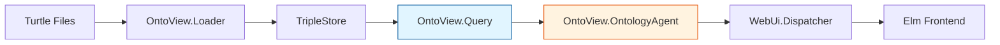

# Phase 1: Ontology Ingestion, Parsing & Canonical Model

> **ARCHITECTURE NOTE:** This phase uses the **web_ui + CloudEvents** architecture. The Canonical Query API defined in this phase serves as the critical boundary between the backend semantic layer and the frontend Elm SPA.

------------------------------------------------------------------------

## Phase 1 Objective

Phase 1 establishes the **entire semantic foundation** of the system.
Its purpose is to ingest one or more cascading OWL/Turtle ontologies,
resolve their import dependency graphs, normalize all RDF triples into
the TripleStore, extract OWL entities, compute class and property
relationships, and expose a stable, deterministic **canonical ontology
query API** for all downstream UI, visualization, and export layers.

The Canonical Query API (`OntoView.Query`) is the **sole interface**
between backend and frontend. All frontend communication happens via
CloudEvents through `OntoView.OntologyAgent`, which calls into this
Query facade.

------------------------------------------------------------------------

## Architecture Context



The **Canonical Query API** (blue) is the stable boundary. All CloudEvents
routing (orange) happens in agents that call this API.

------------------------------------------------------------------------

## Section 1.1 --- Ontology File Loading & Import Resolution

This section ensures that one or more Turtle ontology files can be
loaded together into the TripleStore while fully resolving recursive
`owl:imports` relationships. Provenance must be preserved and import
cycles must be safely detected and rejected.

### Task 1.1.1 --- Load Root Ontology Files

- [ ] 1.1.1.1 Implement `.ttl` file reader
- [ ] 1.1.1.2 Validate file existence and readability
- [ ] 1.1.1.3 Register file metadata (path, base IRI, prefix map)

### Task 1.1.2 --- Resolve `owl:imports` Recursively

- [ ] 1.1.2.1 Parse `owl:imports` triples
- [ ] 1.1.2.2 Load all imported ontologies into TripleStore
- [ ] 1.1.2.3 Build recursive import chain
- [ ] 1.1.2.4 Preserve ontology-of-origin for each triple (named graph)

### Task 1.1.3 --- Import Cycle Detection

- [ ] 1.1.3.1 Detect circular dependencies
- [ ] 1.1.3.2 Abort load on cycle detection
- [ ] 1.1.3.3 Emit diagnostic dependency trace

### Task 1.1.99 --- Unit Tests: Ontology Import Resolution

- [ ] 1.1.99.1 Loads a single ontology correctly
- [ ] 1.1.99.2 Resolves multi-level imports correctly
- [ ] 1.1.99.3 Detects circular imports reliably
- [ ] 1.1.99.4 Preserves per-ontology provenance correctly

------------------------------------------------------------------------

## Section 1.2 --- RDF Triple Parsing & TripleStore Integration

This section integrates with the **TripleStore** library, providing a
persistent, indexed quad store with named-graph support for ontology
provenance.

### Task 1.2.1 --- TripleStore Wrapper Module

- [ ] 1.2.1.1 Create `OntoView.TripleStore` wrapper
- [ ] 1.2.1.2 Implement store open/close lifecycle
- [ ] 1.2.1.3 Configure named graphs for ontology provenance
- [ ] 1.2.1.4 Handle store health monitoring

### Task 1.2.2 --- Triple Loading

- [ ] 1.2.2.1 Parse Turtle into RDF terms
- [ ] 1.2.2.2 Load triples into TripleStore
- [ ] 1.2.2.3 Assign triples to named graphs by ontology source
- [ ] 1.2.2.4 Enable OWL 2 RL reasoning

### Task 1.2.3 --- Blank Node Stabilization

- [ ] 1.2.3.1 Use TripleStore's built-in blank node handling
- [ ] 1.2.3.2 Verify blank node reference consistency
- [ ] 1.2.3.3 Test blank node preservation across queries

### Task 1.2.99 --- Unit Tests: TripleStore Integration

- [ ] 1.2.99.1 Triples load correctly
- [ ] 1.2.99.2 Named graphs maintain provenance
- [ ] 1.2.99.3 Reasoning materializes inferences
- [ ] 1.2.99.4 Store lifecycle manages correctly

------------------------------------------------------------------------

## Section 1.3 --- OWL Entity Extraction

This section extracts all OWL semantic entities including **classes,
object properties, data properties, and individuals** via SPARQL queries
against the TripleStore.

### Task 1.3.1 --- Class Extraction

- [ ] 1.3.1.1 SPARQL query for `owl:Class` instances
- [ ] 1.3.1.2 Extract class IRIs with labels
- [ ] 1.3.1.3 Attach ontology-of-origin metadata

### Task 1.3.2 --- Object Property Extraction

- [ ] 1.3.2.1 SPARQL query for `owl:ObjectProperty`
- [ ] 1.3.2.2 Extract domain and range
- [ ] 1.3.2.3 Register property characteristics

### Task 1.3.3 --- Data Property Extraction

- [ ] 1.3.3.1 SPARQL query for `owl:DatatypeProperty`
- [ ] 1.3.3.2 Extract datatype ranges
- [ ] 1.3.3.3 Register cardinality restrictions

### Task 1.3.4 --- Individual Extraction

- [ ] 1.3.4.1 SPARQL query for named individuals
- [ ] 1.3.4.2 Associate individuals with their classes
- [ ] 1.3.4.3 Extract attached property values

### Task 1.3.99 --- Unit Tests: OWL Entity Extraction

- [ ] 1.3.99.1 Detects all classes correctly
- [ ] 1.3.99.2 Detects all properties correctly
- [ ] 1.3.99.3 Detects all individuals correctly
- [ ] 1.3.99.4 Prevents duplicate IRIs

------------------------------------------------------------------------

## Section 1.4 --- Class Hierarchy Graph Construction

This section builds the **full subclass taxonomy** using `rdfs:subClassOf`,
enabling hierarchical exploration and graph visualization.

### Task 1.4.1 --- SPARQL Hierarchy Queries

- [ ] 1.4.1.1 Query all `rdfs:subClassOf` relationships
- [ ] 1.4.1.2 Build parent → child adjacency list
- [ ] 1.4.1.3 Normalize `owl:Thing` as root

### Task 1.4.2 --- Hierarchy Module

- [ ] 1.4.2.1 Create `OntoView.Hierarchy.ClassHierarchy`
- [ ] 1.4.2.2 Support struct-based in-memory hierarchy
- [ ] 1.4.2.3 Support SPARQL-based live hierarchy
- [ ] 1.4.2.4 Provide ancestor/descendant traversal

### Task 1.4.3 --- Multiple Inheritance Detection

- [ ] 1.4.3.1 Detect multiple parents
- [ ] 1.4.3.2 Preserve all inheritance paths
- [ ] 1.4.3.3 Support hierarchy queries with multiple inheritance

### Task 1.4.99 --- Unit Tests: Class Hierarchy

- [ ] 1.4.99.1 Builds correct subclass chains
- [ ] 1.4.99.2 Supports multiple inheritance
- [ ] 1.4.99.3 Detects root classes correctly
- [ ] 1.4.99.4 Traverses ancestors/descendants correctly

------------------------------------------------------------------------

## Section 1.5 --- Property Domain & Range Resolution

This section establishes **semantic connectivity** between classes using
OWL object and data property definitions via SPARQL queries.

### Task 1.5.1 --- Domain Resolution

- [ ] 1.5.1.1 SPARQL query for `rdfs:domain`
- [ ] 1.5.1.2 Map outbound relation tables (subject → object via property)

### Task 1.5.2 --- Range Resolution

- [ ] 1.5.2.1 SPARQL query for `rdfs:range`
- [ ] 1.5.2.2 Map inbound relation tables (object → subject via property)

### Task 1.5.3 --- Relations Module

- [ ] 1.5.3.1 Create `OntoView.Query.SPARQL.Relations`
- [ ] 1.5.3.2 Implement `inbound/2` for incoming properties
- [ ] 1.5.3.3 Implement `outbound/2` for outgoing properties
- [ ] 1.5.3.4 Implement `all/2` for bidirectional relations

### Task 1.5.99 --- Unit Tests: Property Mappings

- [ ] 1.5.99.1 Domains resolve correctly
- [ ] 1.5.99.2 Ranges resolve correctly
- [ ] 1.5.99.3 Object/data properties are separated correctly
- [ ] 1.5.99.4 Relations include all inverse properties

------------------------------------------------------------------------

## Section 1.6 --- Annotation & Documentation Metadata

This section extracts and normalizes all **human-readable documentation
signals** intended for UI rendering via SPARQL queries.

### Task 1.6.1 --- Label Extraction

- [ ] 1.6.1.1 SPARQL query for `rdfs:label`
- [ ] 1.6.1.2 Preserve language tags
- [ ] 1.6.1.3 Fallback to local name for unlabeled entities

### Task 1.6.2 --- Comment & Definition Extraction

- [ ] 1.6.2.1 SPARQL query for `rdfs:comment`
- [ ] 1.6.2.2 SPARQL query for `skos:definition`
- [ ] 1.6.2.3 SPARQL query for `dc:description`

### Task 1.6.3 --- Annotations Module

- [ ] 1.6.3.1 Create `OntoView.Query.SPARQL.Annotations`
- [ ] 1.6.3.2 Extract all annotations for an entity
- [ ] 1.6.3.3 Support multilingual annotation lookup

### Task 1.6.99 --- Unit Tests: Annotations

- [ ] 1.6.99.1 Multi-language labels supported
- [ ] 1.6.99.2 Comments bind to correct entities
- [ ] 1.6.99.3 Fallback to local name works

------------------------------------------------------------------------

## Section 1.7 --- Canonical Ontology Query API

This section defines the **official semantic boundary** between ontology
infrastructure and all UI layers. **This is the critical interface that
all CloudEvents handlers will call.**

### Task 1.7.1 --- Core Query Module

- [ ] 1.7.1.1 Create `OntoView.Query` facade module
- [ ] 1.7.1.2 Implement store context management
- [ ] 1.7.1.3 Define error handling convention

### Task 1.7.2 --- Class Query Functions

- [ ] 1.7.2.1 `list_classes/1` - Returns all classes
- [ ] 1.7.2.2 `get_class/2` - Returns full class details
- [ ] 1.7.2.3 `list_classes_paginated/2` - Paginated class list
- [ ] 1.7.2.4 `stream_classes/1` - Stream classes for large ontologies

### Task 1.7.3 --- Property Query Functions

- [ ] 1.7.3.1 `list_object_properties/1` - All object properties
- [ ] 1.7.3.2 `list_data_properties/1` - All data properties
- [ ] 1.7.3.3 `get_property/2` - Full property details
- [ ] 1.7.3.4 `get_property_relations/2` - Domain/range mappings

### Task 1.7.4 --- Individual Query Functions

- [ ] 1.7.4.1 `list_individuals/1` - All individuals
- [ ] 1.7.4.2 `get_individual/2` - Individual details
- [ ] 1.7.4.3 `get_individual_class_memberships/2` - Class associations

### Task 1.7.5 --- Hierarchy Query Functions

- [ ] 1.7.5.1 `get_superclasses/2` - Direct parents
- [ ] 1.7.5.2 `get_subclasses/2` - Direct children
- [ ] 1.7.5.3 `get_ancestors/2` - All ancestors
- [ ] 1.7.5.4 `get_descendants/2` - All descendants

### Task 1.7.6 --- Search Functions

- [ ] 1.7.6.1 `search_classes/2` - Full-text class search
- [ ] 1.7.6.2 `search_properties/2` - Property search
- [ ] 1.7.6.3 `search_individuals/2` - Individual search

### Task 1.7.99 --- Unit Tests: Query API

- [ ] 1.7.99.1 Query consistency guaranteed
- [ ] 1.7.99.2 Import completeness guaranteed
- [ ] 1.7.99.3 Deterministic ordering enforced
- [ ] 1.7.99.4 Error handling follows convention

------------------------------------------------------------------------

## Section 1.8 --- SafeQuery Module

This section provides **safe SPARQL query construction** to prevent
injection attacks while allowing dynamic IRI values.

### Task 1.8.1 --- IRI Validation

- [ ] 1.8.1.1 Implement `validate_iri_for_sparql/1`
- [ ] 1.8.1.2 Check for SPARQL injection patterns
- [ ] 1.8.1.3 Validate IRI syntax

### Task 1.8.2 --- Safe Query Macros

- [ ] 1.8.2.1 Create `OntoView.Query.SPARQL.SafeQuery`
- [ ] 1.8.2.2 Implement `safe_query/2` macro for single IRI
- [ ] 1.8.2.3 Implement `safe_query_list/2` macro for IRI lists
- [ ] 1.8.2.4 Add example usage documentation

### Task 1.8.99 --- Unit Tests: SafeQuery

- [ ] 1.8.99.1 Validates safe IRIs correctly
- [ ] 1.8.99.2 Rejects injection patterns
- [ ] 1.8.99.3 Generates correct SPARQL output

------------------------------------------------------------------------

## Section 1.99 --- Phase 1 Integration Testing

This section validates that **all ontologies operate as a single unified
semantic graph** through the TripleStore.

### Task 1.99.1 --- Multi-Ontology Load Validation

- [ ] 1.99.1.1 Load all 5 Elixir ontologies together
- [ ] 1.99.1.2 Resolve full import dependency chain
- [ ] 1.99.1.3 Verify named graph isolation

### Task 1.99.2 --- Cross-Ontology Graph Traversal

- [ ] 1.99.2.1 Traverse subclass chains across ontology boundaries
- [ ] 1.99.2.2 Traverse property relations across ontology boundaries

### Task 1.99.3 --- Global Integrity Validation

- [ ] 1.99.3.1 Validate zero duplicate entities
- [ ] 1.99.3.2 Validate all IRIs dereference cleanly

### Task 1.99.4 --- CloudEvents Integration Readiness

- [ ] 1.99.4.1 Verify Query API returns CloudEvent-compatible data
- [ ] 1.99.4.2 Test error responses format correctly for events
- [ ] 1.99.4.3 Validate pagination metadata structure

------------------------------------------------------------------------

## Module Structure

```
lib/onto_view/
├── ontology/
│   ├── loader.ex                    # Turtle file loading
│   ├── triple_store.ex              # TripleStore wrapper
│   ├── query.ex                     # Canonical query facade
│   └── hierarchy/
│       └── class_hierarchy.ex       # Class hierarchy
├── query/
│   └── sparql/
│       ├── classes.ex               # Class SPARQL queries
│       ├── properties.ex            # Property SPARQL queries
│       ├── individuals.ex           # Individual SPARQL queries
│       ├── relations.ex             # Property relation queries
│       ├── annotations.ex           # Annotation queries
│       └── safe_query.ex            # Safe query construction
└── agents/
    └── ontology_agent.ex            # CloudEvents handler (Phase 2)
```

------------------------------------------------------------------------

## CloudEvents Contract (Phase 2 Preview)

The Query API defined in this phase will be called by
`OntoView.OntologyAgent` in response to CloudEvents:

```elixir
# Event: com.onto_view.class.selected
def handle_event(%CloudEvent{type: "com.onto_view.class.selected", data: data}, state) do
  # Calls Canonical Query API
  case OntoView.Query.get_class(state.store, data.iri) do
    {:ok, class_details} ->
      # Respond with CloudEvent
      {:ok, event} = CloudEvent.data_changed(
        "com.onto_view.class.details",
        "/onto_view/ontology",
        class_details
      )
      {:ok, state, [{:dispatch, event}]}

    {:error, reason} ->
      # Error event
      {:ok, error_event} = CloudEvent.error(
        "com.onto_view.error",
        "/onto_view/ontology",
        reason
      )
      {:ok, state, [{:dispatch, error_event}]}
  end
end
```

------------------------------------------------------------------------

*Phase 1 planning complete. Proceed to Phase 2 for CloudEvents bridge and Elm SPA implementation.*
