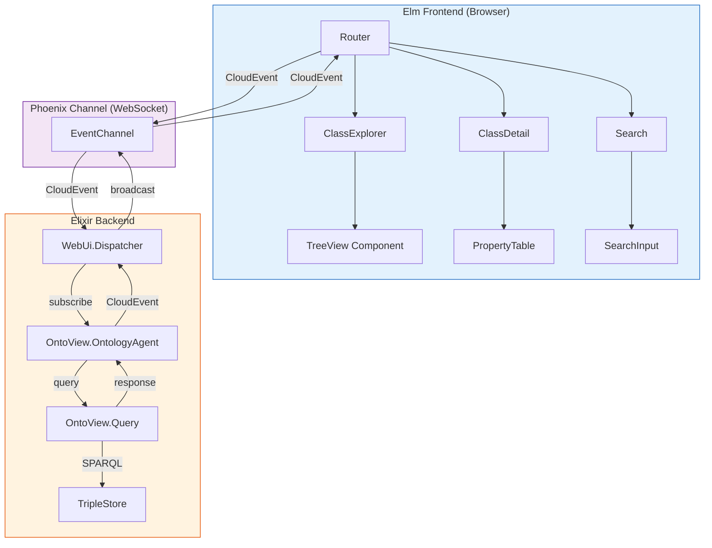
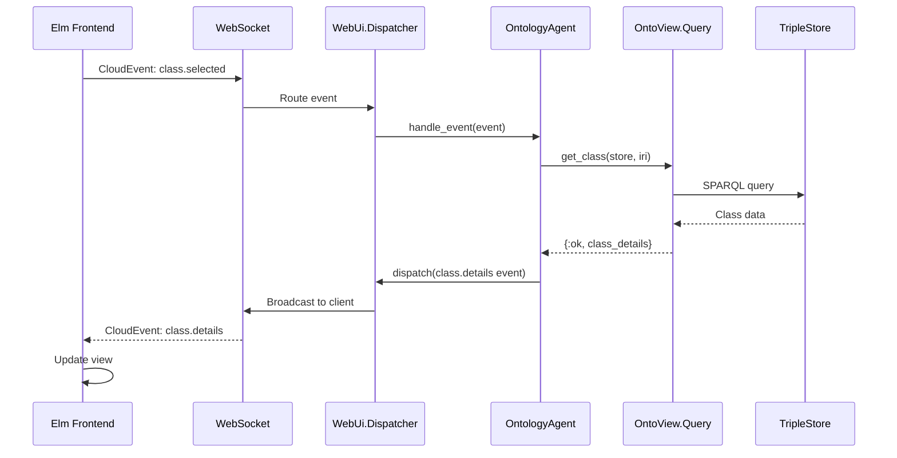

# Phase 2: CloudEvents Bridge & Textual Documentation UI

> **ARCHITECTURE NOTE:** This phase replaces **Phoenix LiveView** with the **web_ui + CloudEvents + Elm SPA** architecture. The UI is entirely client-side Elm, communicating via CloudEvents over WebSockets.

------------------------------------------------------------------------

## Phase 2 Objective

Phase 2 delivers the **core user-facing ontology documentation interface**
using the web_ui library. Its purpose is to:

1. Create the **CloudEvents bridge** between Elm frontend and backend
2. Implement the **OntologyAgent** using `WebUi.Agent` behavior
3. Build the **Elm SPA** with routing, state management, and navigation
4. Expose the canonical ontology model to users through responsive, real-time,
   text-based UI supporting browsing, searching, filtering, and relationship
   navigation across all OWL entities

------------------------------------------------------------------------

## Architecture Context



------------------------------------------------------------------------

## Section 2.1 --- CloudEvents Bridge Infrastructure

This section establishes the **event-driven communication layer** between
Elm frontend and Elixir backend using the web_ui library.

### Task 2.1.1 --- Phoenix Endpoint & Router

- [ ] 2.1.1.1 Create `OntoView.Endpoint` using web_ui
- [ ] 2.1.1.2 Configure `WebUi.EventChannel` for WebSocket
- [ ] 2.1.1.3 Implement SPA catch-all route
- [ ] 2.1.1.4 Configure static asset serving for Elm

### Task 2.1.2 --- Ontology Agent

- [ ] 2.1.2.1 Create `OntoView.OntologyAgent` using `WebUi.Agent`
- [ ] 2.1.2.2 Subscribe to `com.onto_view.*` events
- [ ] 2.1.2.3 Initialize with TripleStore context
- [ ] 2.1.2.4 Implement event-to-query mapping

### Task 2.1.3 --- Application Supervision Tree

- [ ] 2.1.3.1 Configure web_ui children in `application.ex`
- [ ] 2.1.3.2 Start `WebUi.Endpoint` and `WebUi.Dispatcher`
- [ ] 2.1.3.3 Start `OntoView.OntologyAgent`
- [ ] 2.1.3.4 Configure TripleStore initialization

### Task 2.1.99 --- Unit Tests: CloudEvents Bridge

- [ ] 2.1.99.1 Endpoint starts correctly
- [ ] 2.1.99.2 Agent subscribes to events
- [ ] 2.1.99.3 Events are dispatched correctly
- [ ] 2.1.99.4 WebSocket connection established

------------------------------------------------------------------------

## Section 2.2 --- CloudEvents Type Definitions

This section defines the **complete event taxonomy** for onto_view,
ensuring type safety between Elm and Elixir.

### Task 2.2.1 --- Event Type Constants

- [ ] 2.2.1.1 Define event type constants in Elixir
- [ ] 2.2.1.2 Define event type constants in Elm
- [ ] 2.2.1.3 Create event builder functions
- [ ] 2.2.1.4 Document event data schemas

### Task 2.2.2 --- Request Events (Client → Server)

- [ ] 2.2.2.1 `com.onto_view.class.search` - Search classes
- [ ] 2.2.2.2 `com.onto_view.class.selected` - Load class details
- [ ] 2.2.2.3 `com.onto_view.class.expanded` - Expand tree node
- [ ] 2.2.2.4 `com.onto_view.class.collapsed` - Collapse tree node
- [ ] 2.2.2.5 `com.onto_view.property.selected` - Load property details
- [ ] 2.2.2.6 `com.onto_view.individual.selected` - Load individual details
- [ ] 2.2.2.7 `com.onto_view.ontology.reload` - Reload ontology

### Task 2.2.3 --- Response Events (Server → Client)

- [ ] 2.2.3.1 `com.onto_view.class.list` - Class search results
- [ ] 2.2.3.2 `com.onto_view.class.details` - Class detail data
- [ ] 2.2.3.3 `com.onto_view.class.children` - Tree node children
- [ ] 2.2.3.4 `com.onto_view.property.list` - Property listings
- [ ] 2.2.3.5 `com.onto_view.property.details` - Property detail data
- [ ] 2.2.3.6 `com.onto_view.individual.list` - Individual listings
- [ ] 2.2.3.7 `com.onto_view.individual.details` - Individual detail data
- [ ] 2.2.3.8 `com.onto_view.ontology.loaded` - Ontology load confirmation
- [ ] 2.2.3.9 `com.onto_view.error` - Error notifications

### Task 2.2.99 --- Unit Tests: Event Types

- [ ] 2.2.99.1 Event constants match Elixir and Elm
- [ ] 2.2.99.2 Event data validates correctly
- [ ] 2.2.99.3 Event builders create valid CloudEvents
- [ ] 2.2.99.4 JSON encoding/decoding works

------------------------------------------------------------------------

## Section 2.3 --- Elm SPA Foundation

This section establishes the **Elm application foundation** including
routing, state management, and WebSocket integration.

### Task 2.3.1 --- Elm Application Shell

- [ ] 2.3.1.1 Create `Main.elm` entry point
- [ ] 2.3.1.2 Implement Elm application architecture (Model, Msg, update, view)
- [ ] 2.3.1.3 Integrate web_ui WebSocket module
- [ ] 2.3.1.4 Configure ports for JavaScript interop

### Task 2.3.2 --- Client-Side Routing

- [ ] 2.3.2.1 Implement URL route parser
- [ ] 2.3.2.2 Define route data structure
- [ ] 2.3.2.3 Handle browser navigation
- [ ] 2.3.2.4 Support deep-linking to entities

### Task 2.3.3 --- Application State Management

- [ ] 2.3.3.1 Define Model structure (classes, properties, individuals)
- [ ] 2.3.3.2 Implement WebSocket connection state
- [ ] 2.3.3.3 Add loading and error states
- [ ] 2.3.3.4 Implement pagination cursors

### Task 2.3.99 --- Unit Tests: Elm Foundation

- [ ] 2.3.99.1 Routes parse correctly
- [ ] 2.3.99.2 State updates work correctly
- [ ] 2.3.99.3 WebSocket states transition correctly

------------------------------------------------------------------------

## Section 2.4 --- Elm Component: TreeView (Class Hierarchy)

This section implements the **TreeView component** for hierarchical class
exploration, following the term_ui widget pattern adapted for Elm.

### Task 2.4.1 --- TreeView Data Structure

- [ ] 2.4.1.1 Define `TreeNode` type (id, label, children, expanded)
- [ ] 2.4.1.2 Define `TreeState` type (selected, expanded nodes)
- [ ] 2.4.1.3 Create tree builder from class hierarchy
- [ ] 2.4.1.4 Support lazy loading for large branches

### Task 2.4.2 --- TreeView Rendering

- [ ] 2.4.2.1 Implement recursive tree rendering
- [ ] 2.4.2.2 Add expand/collapse indicators
- [ ] 2.4.2.3 Highlight selected node
- [ ] 2.4.2.4 Style tree depth with indentation

### Task 2.4.3 --- TreeView Interactions

- [ ] 2.4.3.1 Handle click to select node
- [ ] 2.4.3.2 Handle click to expand/collapse
- [ ] 2.4.3.3 Send CloudEvent on selection
- [ ] 2.4.3.4 Send CloudEvent on expand/collapse

### Task 2.4.99 --- Unit Tests: TreeView

- [ ] 2.4.99.1 Tree renders correctly
- [ ] 2.4.99.2 Expand/collapse toggles state
- [ ] 2.4.99.3 Selection sends correct CloudEvent

------------------------------------------------------------------------

## Section 2.5 --- Elm Component: SearchInput

This section implements the **search input component** with debouncing
and real-time results.

### Task 2.5.1 --- SearchInput State

- [ ] 2.5.1.1 Define `SearchState` type (query, results, loading)
- [ ] 2.5.1.2 Implement debouncing logic
- [ ] 2.5.1.3 Add filter state (ontology selection)
- [ ] 2.5.1.4 Track search result cursor

### Task 2.5.2 --- SearchInput Rendering

- [ ] 2.5.2.1 Render search input field
- [ ] 2.5.2.2 Render autocomplete dropdown
- [ ] 2.5.2.3 Show loading indicator
- [ ] 2.5.2.4 Display result count

### Task 2.5.3 --- SearchInput Interactions

- [ ] 2.5.3.1 Handle input changes with debounce
- [ ] 2.5.3.2 Send CloudEvent on search
- [ ] 2.5.3.3 Handle result selection
- [ ] 2.5.3.4 Clear search on escape

### Task 2.5.99 --- Unit Tests: SearchInput

- [ ] 2.5.99.1 Debouncing works correctly
- [ ] 2.5.99.2 Search CloudEvent is sent
- [ ] 2.5.99.3 Results display correctly

------------------------------------------------------------------------

## Section 2.6 --- Elm Page: Class Explorer

This section implements the **main class browsing page** with TreeView
and search integration.

### Task 2.6.1 --- ClassExplorer Model

- [ ] 2.6.1.1 Define `ClassExplorerModel` type
- [ ] 2.6.1.2 Integrate TreeView state
- [ ] 2.6.1.3 Integrate SearchInput state
- [ ] 2.6.1.4 Add selected class state

### Task 2.6.2 --- ClassExplorer Rendering

- [ ] 2.6.2.1 Render sidebar with TreeView
- [ ] 2.6.2.2 Render search bar
- [ ] 2.6.2.3 Render class detail panel
- [ ] 2.6.2.4 Apply responsive layout

### Task 2.6.3 --- ClassExplorer Interactions

- [ ] 2.6.3.1 Handle tree node selection
- [ ] 2.6.3.2 Handle search result selection
- [ ] 2.6.3.3 Navigate to detail view
- [ ] 2.6.3.4 Update URL on selection

### Task 2.6.99 --- Unit Tests: ClassExplorer

- [ ] 2.6.99.1 Page loads correctly
- [ ] 2.6.99.2 Tree and search work together
- [ ] 2.6.99.3 URL updates on navigation

------------------------------------------------------------------------

## Section 2.7 --- Elm Page: Class Detail View

This section renders the **full OWL documentation for a selected class**.

### Task 2.7.1 --- ClassDetail Model

- [ ] 2.7.1.1 Define `ClassDetailModel` type
- [ ] 2.7.1.2 Add loading state
- [ ] 2.7.1.3 Add error state
- [ ] 2.7.1.4 Cache class data

### Task 2.7.2 --- ClassDetail Rendering

- [ ] 2.7.2.1 Render class identity (label, IRI, ontology)
- [ ] 2.7.2.2 Render description panel (comments, definitions)
- [ ] 2.7.2.3 Render hierarchy view (superclasses, subclasses)
- [ ] 2.7.2.4 Render property relationships (inbound, outbound)

### Task 2.7.3 --- ClassDetail Interactions

- [ ] 2.7.3.1 Handle click to navigate to related class
- [ ] 2.7.3.2 Handle click to navigate to property
- [ ] 2.7.3.3 Send CloudEvent for relationship navigation
- [ ] 2.7.3.4 Update browser history

### Task 2.7.99 --- Unit Tests: ClassDetail

- [ ] 2.7.99.1 Detail view renders correctly
- [ ] 2.7.99.2 Relationship links work
- [ ] 2.7.99.3 CloudEvents are sent correctly

------------------------------------------------------------------------

## Section 2.8 --- Elm Component: PropertyTable

This section implements the **property table component** for displaying
object and data properties.

### Task 2.8.1 --- PropertyTable Types

- [ ] 2.8.1.1 Define `Property` type
- [ ] 2.8.1.2 Define `PropertyTableState` type
- [ ] 2.8.1.3 Add sorting state
- [ ] 2.8.1.4 Add pagination state

### Task 2.8.2 --- PropertyTable Rendering

- [ ] 2.8.2.1 Render table with sortable headers
- [ ] 2.8.2.2 Render property rows (domain, range, characteristics)
- [ ] 2.8.2.3 Render property type badges
- [ ] 2.8.2.4 Render pagination controls

### Task 2.8.3 --- PropertyTable Interactions

- [ ] 2.8.3.1 Handle sort column click
- [ ] 2.8.3.2 Handle property row click
- [ ] 2.8.3.3 Handle pagination navigation
- [ ] 2.8.3.4 Send CloudEvent for property selection

### Task 2.8.99 --- Unit Tests: PropertyTable

- [ ] 2.8.99.1 Table renders correctly
- [ ] 2.8.99.2 Sorting works
- [ ] 2.8.99.3 Pagination works

------------------------------------------------------------------------

## Section 2.9 --- OntologyAgent Event Handlers

This section implements the **server-side event handlers** in
`OntoView.OntologyAgent` that bridge CloudEvents to the Query API.

### Task 2.9.1 --- Class Event Handlers

- [ ] 2.9.1.1 Handle `com.onto_view.class.search` → call `Query.search_classes/2`
- [ ] 2.9.1.2 Handle `com.onto_view.class.selected` → call `Query.get_class/2`
- [ ] 2.9.1.3 Handle `com.onto_view.class.expanded` → call `Query.get_subclasses/2`
- [ ] 2.9.1.4 Respond with `com.onto_view.class.*` events

### Task 2.9.2 --- Property Event Handlers

- [ ] 2.9.2.1 Handle `com.onto_view.property.selected` → call `Query.get_property/2`
- [ ] 2.9.2.2 Handle `com.onto_view.property.list` → call `Query.list_*_properties/1`
- [ ] 2.9.2.3 Respond with `com.onto_view.property.*` events

### Task 2.9.3 --- Individual Event Handlers

- [ ] 2.9.3.1 Handle `com.onto_view.individual.selected` → call `Query.get_individual/2`
- [ ] 2.9.3.2 Handle `com.onto_view.individual.list` → call `Query.list_individuals/1`
- [ ] 2.9.3.3 Respond with `com.onto_view.individual.*` events

### Task 2.9.4 --- Error Handling

- [ ] 2.9.4.1 Catch query errors and convert to CloudEvents
- [ ] 2.9.4.2 Send `com.onto_view.error` events
- [ ] 2.9.4.3 Include error details and context

### Task 2.9.99 --- Unit Tests: OntologyAgent

- [ ] 2.9.99.1 Class queries return correct CloudEvents
- [ ] 2.9.99.2 Property queries return correct CloudEvents
- [ ] 2.9.99.3 Errors are converted correctly

------------------------------------------------------------------------

## Section 2.99 --- Phase 2 Integration Testing

This section validates the **end-to-end CloudEvents flow** from Elm
frontend through OntologyAgent to Query API and back.

### Task 2.99.1 --- WebSocket Communication Flow

- [ ] 2.99.1.1 Elm sends CloudEvent → server receives
- [ ] 2.99.1.2 Agent handles event → Query API called
- [ ] 2.99.1.3 Response CloudEvent → Elm receives
- [ ] 2.99.1.4 UI updates with new data

### Task 2.99.2 --- Navigation Flow

- [ ] 2.99.2.1 Load class explorer → tree populated
- [ ] 2.99.2.2 Click class → detail view loads
- [ ] 2.99.2.3 Click property link → property detail loads
- [ ] 2.99.2.4 Browser back button works

### Task 2.99.3 --- Search Flow

- [ ] 2.99.3.1 Type search query → debounced
- [ ] 2.99.3.2 Results received → dropdown shows
- [ ] 2.99.3.3 Select result → detail view loads
- [ ] 2.99.3.4 URL updates correctly

------------------------------------------------------------------------

## Module Structure

### Backend (Elixir)

```
lib/onto_view/
├── agents/
│   └── ontology_agent.ex           # WebUi.Agent implementation
├── web/
│   ├── endpoint.ex                 # Phoenix endpoint
│   ├── router.ex                   # SPA routes
│   └── telemetry.ex                # CloudEvents telemetry
└── cloudevents/
    ├── types.ex                    # Event type constants
    └── builders.ex                 # Event builder functions
```

### Frontend (Elm)

```
assets/elm/src/
├── Main.elm                        # Application entry
├── OntoView/
│   ├── CloudEvents.elm             # Event type definitions
│   ├── State.elm                   # Application state
│   ├── Routes.elm                  # URL routing
│   ├── MsgTypes.elm                # Message union type
│   ├── Pages/
│   │   ├── ClassExplorer.elm       # Main browsing page
│   │   ├── ClassDetail.elm         # Class detail view
│   │   ├── PropertyDetail.elm      # Property detail view
│   │   └── IndividualDetail.elm    # Individual detail view
│   └── Components/
│       ├── TreeView.elm            # term_ui TreeView pattern
│       ├── SearchInput.elm         # Search with debounce
│       ├── PropertyTable.elm       # Property listing
│       └── DescriptionPanel.elm    # Documentation rendering
```

------------------------------------------------------------------------

## CloudEvents Flow Example



------------------------------------------------------------------------

*Phase 2 planning complete. Proceed to Phase 3 for graph visualization with Elm canvas.*
