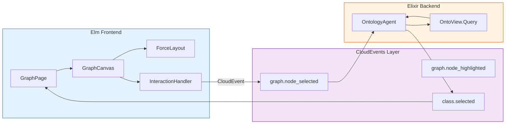
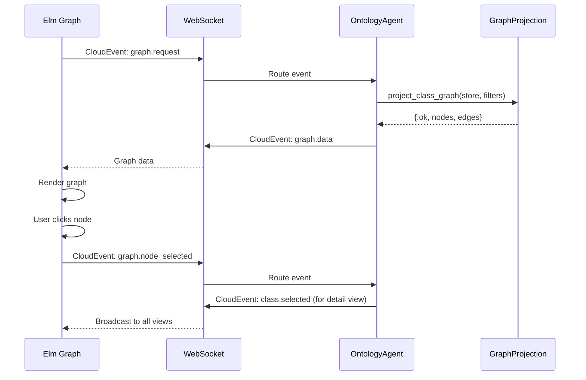

# Phase 3: Interactive Graph Visualization Engine

> **ARCHITECTURE NOTE:** This phase uses **pure Elm canvas rendering** for graph visualization, replacing the original JS hooks + D3.js approach. All graph interaction happens via CloudEvents.

------------------------------------------------------------------------

## Phase 3 Objective

Phase 3 delivers the **visual ontology exploration system** using pure Elm.
Its purpose is to:

1. Project the canonical ontology graph into **graph-ready node/edge data**
2. Implement **force-directed layout** in pure Elm
3. Render the graph using **Elm canvas** (no external JS libraries)
4. Enable **bidirectional synchronization** with textual documentation views
   via CloudEvents

------------------------------------------------------------------------

## Architecture Context



------------------------------------------------------------------------

## Section 3.1 --- Graph Data Projection Engine

This section transforms the canonical ontology model into **graph-ready
node and edge projections** suitable for visualization.

### Task 3.1.1 --- Graph Projection Module (Backend)

- [ ] 3.1.1.1 Create `OntoView.Query.GraphProjection` module
- [ ] 3.1.1.2 Implement `project_class_graph/2` - nodes and edges from classes
- [ ] 3.1.1.3 Implement `project_property_graph/2` - include property relationships
- [ ] 3.1.1.4 Add filtering options (ontology, depth, node types)

### Task 3.1.2 --- Node Data Structure

- [ ] 3.1.2.1 Define node data schema (id, label, type, ontology, metadata)
- [ ] 3.1.2.2 Assign stable node identifiers based on IRIs
- [ ] 3.1.2.3 Include ontology-of-origin for color coding
- [ ] 3.1.2.4 Add hierarchy depth metadata

### Task 3.1.3 --- Edge Data Structure

- [ ] 3.1.3.1 Define edge data schema (id, source, target, label, type)
- [ ] 3.1.3.2 Project `rdfs:subClassOf` as subclass edges
- [ ] 3.1.3.3 Project object properties as domain→range edges
- [ ] 3.1.3.4 Prevent duplicate edges

### Task 3.1.99 --- Unit Tests: Graph Projection

- [ ] 3.1.99.1 All classes become nodes
- [ ] 3.1.99.2 All subclass relationships become edges
- [ ] 3.1.99.3 Property edges resolve correctly
- [ ] 3.1.99.4 No duplicate edges created

------------------------------------------------------------------------

## Section 3.2 --- Elm Force-Directed Layout Engine

This section implements the **force-directed graph layout algorithm**
in pure Elm.

### Task 3.2.1 --- Layout Data Types

- [ ] 3.2.1.1 Define `GraphData` type (nodes, edges)
- [ ] 3.2.1.2 Define `NodeLayout` type (position, velocity, force)
- [ ] 3.2.1.3 Define `LayoutConfig` type (repulsion, spring, damping)
- [ ] 3.2.1.4 Define `LayoutState` type (iteration, stabilized)

### Task 3.2.2 --- Force Simulation

- [ ] 3.2.2.1 Implement repulsion force (Coulomb's law)
- [ ] 3.2.2.2 Implement spring force (Hooke's law)
- [ ] 3.2.2.3 Implement centering force
- [ ] 3.2.2.4 Implement collision detection

### Task 3.2.3 --- Layout Iteration

- [ ] 3.2.3.1 Implement single iteration step
- [ ] 3.2.3.2 Add stabilization detection
- [ ] 3.2.3.3 Limit maximum iterations
- [ ] 3.2.3.4 Support animation frames

### Task 3.2.99 --- Unit Tests: Force Layout

- [ ] 3.2.99.1 Layout converges without overlap
- [ ] 3.2.99.2 Connected nodes cluster together
- [ ] 3.2.99.3 Layout stabilizes within iterations

------------------------------------------------------------------------

## Section 3.3 --- Elm Canvas Rendering Engine

This section renders the **interactive force-directed ontology graph**
using pure Elm canvas (no external JS libraries).

### Task 3.3.1 --- Canvas Setup

- [ ] 3.3.1.1 Create `GraphCanvas` module
- [ ] 3.3.1.2 Initialize canvas with dimensions
- [ ] 3.3.1.3 Handle canvas resize events
- [ ] 3.3.1.4 Configure high-DPI rendering

### Task 3.3.2 --- Node Rendering

- [ ] 3.3.2.1 Render node circles with ontology colors
- [ ] 3.3.2.2 Render node labels
- [ ] 3.3.2.3 Highlight selected nodes
- [ ] 3.3.2.4 Dim non-matching nodes during search

### Task 3.3.3 --- Edge Rendering

- [ ] 3.3.3.1 Render edges as lines
- [ ] 3.3.3.2 Label edges with property names
- [ ] 3.3.3.3 Style edges by type (subclass vs property)
- [ ] 3.3.3.4 Highlight edges connected to selected node

### Task 3.3.4 --- Viewport Controls

- [ ] 3.3.4.1 Implement pan (drag background)
- [ ] 3.3.4.2 Implement zoom (scroll wheel)
- [ ] 3.3.4.3 Implement fit-to-screen
- [ ] 3.3.4.4 Implement reset view

### Task 3.3.99 --- Unit Tests: Canvas Rendering

- [ ] 3.3.99.1 Graph mounts correctly
- [ ] 3.3.99.2 Zoom and pan work correctly
- [ ] 3.3.99.3 Layout stabilizes visually

------------------------------------------------------------------------

## Section 3.4 --- Graph Interaction Handlers

This section implements **user interactions** with the graph via
CloudEvents.

### Task 3.4.1 --- Mouse Interactions

- [ ] 3.4.1.1 Handle click to select node
- [ ] 3.4.1.2 Handle hover to highlight node
- [ ] 3.4.1.3 Handle drag to move node
- [ ] 3.4.1.4 Handle background drag for pan

### Task 3.4.2 --- Keyboard Interactions

- [ ] 3.4.2.1 Arrow keys to pan
- [ ] 3.4.2.2 +/- keys to zoom
- [ ] 3.4.2.3 Escape to deselect
- [ ] 3.4.2.4 R key to reset view

### Task 3.4.3 --- CloudEvents Integration

- [ ] 3.4.3.1 Send `com.onto_view.graph.node_selected` on click
- [ ] 3.4.3.2 Send `com.onto_view.graph.node_highlighted` on hover
- [ ] 3.4.3.3 Receive `com.onto_view.class.selected` from detail view
- [ ] 3.4.3.4 Receive `com.onto_view.graph.focus` to zoom to node

### Task 3.4.99 --- Unit Tests: Interactions

- [ ] 3.4.99.1 Click selects node and sends CloudEvent
- [ ] 3.4.99.2 Hover highlights node
- [ ] 3.4.99.3 Keyboard controls work

------------------------------------------------------------------------

## Section 3.5 --- Bidirectional Synchronization

This section ensures full **synchronization between graph and textual
documentation views** via CloudEvents.

### Task 3.5.1 --- Graph → Documentation Sync

- [ ] 3.5.1.1 Clicking node sends `graph.node_selected` event
- [ ] 3.5.1.2 Event triggers navigation to class detail
- [ ] 3.5.1.3 Update URL to reflect selection
- [ ] 3.5.1.4 Highlight node in graph if already on graph page

### Task 3.5.2 --- Documentation → Graph Sync

- [ ] 3.5.2.1 Receiving `class.selected` event highlights node
- [ ] 3.5.2.2 Auto-zoom to selected node
- [ ] 3.5.2.3 Highlight connected neighbors
- [ ] 3.5.2.4 Dim unrelated graph regions

### Task 3.5.3 --- Selection State Management

- [ ] 3.5.3.1 Track selected node across page navigation
- [ ] 3.5.3.2 Persist selection in URL
- [ ] 3.5.3.3 Clear selection on escape
- [ ] 3.5.3.4 Handle selection of non-visible nodes

### Task 3.5.99 --- Unit Tests: Synchronization

- [ ] 3.5.99.1 Graph selection updates documentation view
- [ ] 3.5.99.2 Documentation selection highlights graph node
- [ ] 3.5.99.3 Selection state persists across navigation

------------------------------------------------------------------------

## Section 3.6 --- Graph Filtering & Focus Engine

This section introduces **semantic graph filtering** to control visual
complexity.

### Task 3.6.1 --- Search-Based Filtering

- [ ] 3.6.1.1 Filter nodes by text query
- [ ] 3.6.1.2 Dim non-matching nodes
- [ ] 3.6.1.3 Highlight matching nodes
- [ ] 3.6.1.4 Send CloudEvent on search

### Task 3.6.2 --- Ontology-Origin View Layers

- [ ] 3.6.2.1 Toggle visibility per ontology
- [ ] 3.6.2.2 Color-code by ontology
- [ ] 3.6.2.3 Show ontology legend
- [ ] 3.6.2.4 Filter edges by ontology

### Task 3.6.3 --- Neighborhood Focus Mode

- [ ] 3.6.3.1 Show only K-hop neighbors
- [ ] 3.6.3.2 Fade distant graph regions
- [ ] 3.6.3.3 Configure K value (1-3 hops)
- [ ] 3.6.3.4 Animate focus transitions

### Task 3.6.99 --- Unit Tests: Graph Filtering

- [ ] 3.6.99.1 Search filtering works
- [ ] 3.6.99.2 Ontology layer filtering works
- [ ] 3.6.99.3 Focus mode limits visible graph

------------------------------------------------------------------------

## Section 3.7 --- OntologyAgent Graph Event Handlers

This section implements the **server-side graph event handlers** in
`OntoView.OntologyAgent`.

### Task 3.7.1 --- Graph Request Handlers

- [ ] 3.7.1.1 Handle `com.onto_view.graph.request` → call `Query.GraphProjection.project_*`
- [ ] 3.7.1.2 Include filter options (ontology, depth)
- [ ] 3.7.1.3 Respond with `com.onto_view.graph.data` event
- [ ] 3.7.1.4 Cache projection results

### Task 3.7.2 --- Graph Interaction Handlers

- [ ] 3.7.2.1 Handle `com.onto_view.graph.node_selected` → respond with node details
- [ ] 3.7.2.2 Handle `com.onto_view.graph.neighborhood` → return K-hop neighbors
- [ ] 3.7.2.3 Handle `com.onto_view.graph.search` → filter nodes
- [ ] 3.7.2.4 Respond with appropriate `com.onto_view.graph.*` events

### Task 3.7.99 --- Unit Tests: Graph Event Handlers

- [ ] 3.7.99.1 Graph request returns valid projection
- [ ] 3.7.99.2 Neighborhood queries return correct nodes
- [ ] 3.7.99.3 Search filtering returns correct results

------------------------------------------------------------------------

## Section 3.99 --- Phase 3 Integration Testing

This section validates the **complete real-time visual ontology
exploration workflow**.

### Task 3.99.1 --- Visual Navigation Validation

- [ ] 3.99.1.1 Navigate from graph to class view
- [ ] 3.99.1.2 Navigate from class view to graph
- [ ] 3.99.1.3 URL updates correctly on navigation

### Task 3.99.2 --- Filtering & Layout Stability Validation

- [ ] 3.99.2.1 Apply filtering without layout collapse
- [ ] 3.99.2.2 Reset filters without graph loss
- [ ] 3.99.2.3 Layout remains stable during interaction

### Task 3.99.3 --- Performance Validation

- [ ] 3.99.3.1 Graph renders within 2 seconds for 100 nodes
- [ ] 3.99.3.2 Layout stabilizes within 5 seconds
- [ ] 3.99.3.3 Zoom/pan remains smooth (60fps)

------------------------------------------------------------------------

## Module Structure

### Backend (Elixir)

```
lib/onto_view/
├── query/
│   └── graph_projection.ex         # Graph data projection
└── agents/
    └── ontology_agent.ex           # Graph event handlers (extended)
```

### Frontend (Elm)

```
assets/elm/src/OntoView/
├── Pages/
│   └── GraphView.elm               # Graph visualization page
└── Graph/
    ├── Data.elm                    # Graph data types
    ├── Projection.elm              # Node/edge projection
    ├── Layout/
    │   ├── ForceDirected.elm       # Force simulation
    │   ├── Config.elm              # Layout configuration
    │   └── Iteration.elm           # Layout iteration
    ├── Renderer/
    │   ├── Canvas.elm              # Canvas rendering
    │   ├── Nodes.elm               # Node drawing
    │   ├── Edges.elm               # Edge drawing
    │   └── Labels.elm              # Label drawing
    ├── Interaction/
    │   ├── Mouse.elm               # Mouse handling
    │   ├── Keyboard.elm            # Keyboard handling
    │   └── Drag.elm                # Node dragging
    ├── Sync.elm                    # CloudEvents synchronization
    └── Filter.elm                  # Graph filtering
```

------------------------------------------------------------------------

## CloudEvents Flow Example



------------------------------------------------------------------------

*Phase 3 planning complete. Proceed to Phase 4 for UX enhancements, accessibility, and widget patterns.*
