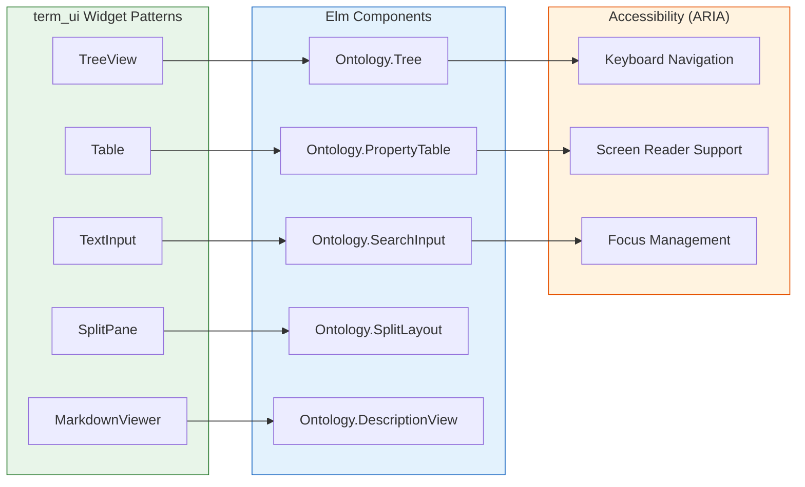

# Phase 4: UX Enhancements, Accessibility & Widget Patterns

> **ARCHITECTURE NOTE:** This phase uses **Elm components following term_ui widget patterns**. Accessibility is implemented via ARIA attributes in Elm HTML rendering. All UX state is managed client-side in Elm.

------------------------------------------------------------------------

## Phase 4 Objective

Phase 4 enhances the ontology documentation platform with **first-class
property documentation**, advanced usability improvements, and **full
accessibility compliance** using Elm components. The goal is to ensure that
object properties, data properties, and individuals are as discoverable and
navigable as classes, while guaranteeing WCAG 2.1 AA compliance through
client-side rendering.

------------------------------------------------------------------------

## Architecture Context



------------------------------------------------------------------------

## Section 4.1 --- Property Documentation System (Elm)

This section establishes **full standalone documentation views for
object and data properties** as Elm components.

### Task 4.1.1 --- PropertyDetail Page

- [ ] 4.1.1.1 Create `PropertyDetail.elm` page
- [ ] 4.1.1.2 Render property identity panel (label, IRI, ontology)
- [ ] 4.1.1.3 Add property type indicators
- [ ] 4.1.1.4 Support deep-linking via URL

### Task 4.1.2 --- Domain & Range Panels

- [ ] 4.1.2.1 Render domain class links
- [ ] 4.1.2.2 Render range class links
- [ ] 4.1.2.3 Support multi-domain and multi-range
- [ ] 4.1.2.4 Add navigation via CloudEvents

### Task 4.1.3 --- OWL Property Characteristics

- [ ] 4.1.3.1 Render `owl:FunctionalProperty`
- [ ] 4.1.3.2 Render `owl:InverseFunctionalProperty`
- [ ] 4.1.3.3 Render `owl:TransitiveProperty`
- [ ] 4.1.3.4 Render `owl:SymmetricProperty`
- [ ] 4.1.3.5 Render `owl:AsymmetricProperty`
- [ ] 4.1.3.6 Render `owl:ReflexiveProperty`
- [ ] 4.1.3.7 Render `owl:IrreflexiveProperty`

### Task 4.1.99 --- Unit Tests: Property Views

- [ ] 4.1.99.1 Property labels render correctly
- [ ] 4.1.99.2 Domain and range links resolve correctly
- [ ] 4.1.99.3 OWL property characteristics render correctly
- [ ] 4.1.99.4 Deep-linking to properties works

------------------------------------------------------------------------

## Section 4.2 --- Data Property Typing & Constraint Rendering

This section ensures that **datatype constraints and literal semantics**
are visibly documented for data properties.

### Task 4.2.1 --- Datatype Range Rendering

- [ ] 4.2.1.1 Render XSD datatype IRIs
- [ ] 4.2.1.2 Render human-readable datatype labels
- [ ] 4.2.1.3 Add datatype descriptions
- [ ] 4.2.1.4 Link datatype definitions

### Task 4.2.2 --- Cardinality & Restriction Support

- [ ] 4.2.2.1 Render `owl:minCardinality`
- [ ] 4.2.2.2 Render `owl:maxCardinality`
- [ ] 4.2.2.3 Render `owl:allValuesFrom`
- [ ] 4.2.2.4 Render `owl:someValuesFrom`
- [ ] 4.2.2.5 Render `owl:hasValue`

### Task 4.2.99 --- Unit Tests: Data Property Constraints

- [ ] 4.2.99.1 Datatype IRIs render correctly
- [ ] 4.2.99.2 Cardinality constraints render correctly
- [ ] 4.2.99.3 Restrictions display correctly

------------------------------------------------------------------------

## Section 4.3 --- Individual (Instance) Documentation System

This section supports **first-class documentation of named individuals**
as Elm components.

### Task 4.3.1 --- IndividualDetail Page

- [ ] 4.3.1.1 Create `IndividualDetail.elm` page
- [ ] 4.3.1.2 Render individual identity panel
- [ ] 4.3.1.3 Render canonical IRI
- [ ] 4.3.1.4 Render ontology prefix

### Task 4.3.2 --- Class Membership Panel

- [ ] 4.3.2.1 Render asserted class memberships
- [ ] 4.3.2.2 Render inferred class memberships (if reasoning enabled)
- [ ] 4.3.2.3 Distinguish asserted vs inferred
- [ ] 4.3.2.4 Link to class detail views

### Task 4.3.3 --- Attached Data Value Panel

- [ ] 4.3.3.1 Render associated data properties
- [ ] 4.3.3.2 Render literal values
- [ ] 4.3.3.3 Render language tags
- [ ] 4.3.3.4 Render datatype annotations

### Task 4.3.99 --- Unit Tests: Individual Documentation

- [ ] 4.3.99.1 Individual identity renders correctly
- [ ] 4.3.99.2 Class membership renders correctly
- [ ] 4.3.99.3 Data values render correctly
- [ ] 4.3.99.4 Deep-linking to individuals works

------------------------------------------------------------------------

## Section 4.4 --- UX Enhancements via Elm Components

This section improves overall **user experience, performance, and
navigation clarity** using Elm components following term_ui patterns.

### Task 4.4.1 --- Persistent Navigation State

- [ ] 4.4.1.1 Store sidebar expansion state in localStorage
- [ ] 4.4.1.2 Preserve selected class across reloads
- [ ] 4.4.1.3 Restore scroll position on navigation
- [ ] 4.4.1.4 Cache viewed entities

### Task 4.4.2 --- Breadcrumb Navigation (term_ui pattern)

- [ ] 4.4.2.1 Create `Breadcrumb.elm` component
- [ ] 4.4.2.2 Render class hierarchy breadcrumb trail
- [ ] 4.4.2.3 Render property navigation breadcrumbs
- [ ] 4.4.2.4 Handle breadcrumb click navigation

### Task 4.4.3 --- SplitPane Layout (term_ui pattern)

- [ ] 4.4.3.1 Create `SplitPane.elm` component
- [ ] 4.4.3.2 Implement resizable panes
- [ ] 4.4.3.3 Store pane size in localStorage
- [ ] 4.4.3.4 Handle collapse/expand

### Task 4.4.4 --- Performance Optimizations

- [ ] 4.4.4.1 Virtualize large class lists (lazy loading)
- [ ] 4.4.4.2 Lazy-load graph on demand
- [ ] 4.4.4.3 Implement pagination for large result sets
- [ ] 4.4.4.4 Add loading skeletons

### Task 4.4.99 --- Unit Tests: UX Enhancements

- [ ] 4.4.99.1 Navigation state persists correctly
- [ ] 4.4.99.2 Breadcrumbs render correctly
- [ ] 4.4.99.3 SplitPane resizes correctly
- [ ] 4.4.99.4 Lazy loading activates correctly

------------------------------------------------------------------------

## Section 4.5 --- Accessibility & WCAG Compliance

This section ensures **full accessibility support** according to WCAG
2.1 AA standards, implemented in Elm HTML rendering.

### Task 4.5.1 --- Keyboard Navigation

- [ ] 4.5.1.1 Implement tab traversal through all UI components
- [ ] 4.5.1.2 Arrow-key navigation for TreeView
- [ ] 4.5.1.3 Arrow-key navigation for tables
- [ ] 4.5.1.4 Escape key to close modals/dropdowns
- [ ] 4.5.1.5 Enter/Space to activate focused elements
- [ ] 4.5.1.6 Home/End for list navigation
- [ ] 4.5.1.7 Page Up/Down for scrolling

### Task 4.5.2 --- Focus Management

- [ ] 4.5.2.1 Implement visible focus indicators
- [ ] 4.5.2.2 Manage focus order (tabindex)
- [ ] 4.5.2.3 Restore focus after navigation
- [ ] 4.5.2.4 Focus trap in modals
- [ ] 4.5.2.5 Skip to main content link

### Task 4.5.3 --- ARIA Roles & Attributes

- [ ] 4.5.3.1 Apply ARIA roles to TreeView (tree, treeitem, group)
- [ ] 4.5.3.2 Apply ARIA roles to tables (table, thead, tbody, row)
- [ ] 4.5.3.3 Apply ARIA roles to graph (figure, img with longdesc)
- [ ] 4.5.3.4 Add aria-label to all icon-only buttons
- [ ] 4.5.3.5 Add aria-expanded to expandable elements
- [ ] 4.5.3.6 Add aria-selected for selected items
- [ ] 4.5.3.7 Add aria-live for dynamic content regions

### Task 4.5.4 --- Screen Reader Support

- [ ] 4.5.4.1 Provide screen-reader labels for all interactive elements
- [ ] 4.5.4.2 Announce search result counts
- [ ] 4.5.4.3 Announce navigation changes
- [ ] 4.5.4.4 Announce graph node selection
- [ ] 4.5.4.5 Provide text alternatives for visual content

### Task 4.5.5 --- Visual Accessibility

- [ ] 4.5.5.1 Enforce color contrast ratios (4.5:1 for normal text)
- [ ] 4.5.5.2 Provide clear focus outlines
- [ ] 4.5.5.3 Support dark mode (prefers-color-scheme)
- [ ] 4.5.5.4 Support high contrast mode
- [ ] 4.5.5.5 Ensure text is resizable (browser zoom)
- [ ] 4.5.5.6 Don't rely on color alone to convey information

### Task 4.5.99 --- Unit Tests: Accessibility

- [ ] 4.5.99.1 Keyboard-only navigation passes
- [ ] 4.5.99.2 Screen reader labels available
- [ ] 4.5.99.3 Color contrast meets WCAG AA
- [ ] 4.5.99.4 Focus order is logical
- [ ] 4.5.99.5 ARIA attributes are correct

------------------------------------------------------------------------

## Section 4.6 --- Additional Elm Widgets (term_ui patterns)

This section implements additional UI components following term_ui
widget patterns for a complete user experience.

### Task 4.6.1 --- Tabs Component

- [ ] 4.6.1.1 Create `Tabs.elm` component
- [ ] 4.6.1.2 Render tab list with aria-role="tablist"
- [ ] 4.6.1.3 Handle tab selection
- [ ] 4.6.1.4 Support keyboard navigation (arrow keys)

### Task 4.6.2 --- AlertDialog Component

- [ ] 4.6.2.1 Create `AlertDialog.elm` component
- [ ] 4.6.2.2 Render modal dialog with aria-role="dialog"
- [ ] 4.6.2.3 Implement focus trap
- [ ] 4.6.2.4 Handle escape to close

### Task 4.6.3 --- Toast Notifications

- [ ] 4.6.3.1 Create `Toast.elm` component
- [ ] 4.6.3.2 Implement auto-dismiss
- [ ] 4.6.3.3 Add aria-live region
- [ ] 4.6.3.4 Support multiple stacked toasts

### Task 4.6.4 --- DescriptionPanel (MarkdownViewer pattern)

- [ ] 4.6.4.1 Create `DescriptionPanel.elm` component
- [ ] 4.6.4.2 Render markdown content (rdfs:comment, skos:definition)
- [ ] 4.6.4.3 Support code formatting
- [ ] 4.6.4.4 Handle RDF term links

### Task 4.6.99 --- Unit Tests: Additional Widgets

- [ ] 4.6.99.1 Tabs work with keyboard
- [ ] 4.6.99.2 AlertDialog traps focus
- [ ] 4.6.99.3 Toasts announce correctly
- [ ] 4.6.99.4 Markdown renders safely

------------------------------------------------------------------------

## Section 4.7 --- Property & Individual Event Handlers

This section extends `OntoView.OntologyAgent` with property and individual
event handlers.

### Task 4.7.1 --- Property Event Handlers

- [ ] 4.7.1.1 Handle `com.onto_view.property.selected` → call `Query.get_property/2`
- [ ] 4.7.1.2 Handle `com.onto_view.property.list` → call `Query.list_*_properties/1`
- [ ] 4.7.1.3 Handle `com.onto_view.property.domain` → get domain classes
- [ ] 4.7.1.4 Handle `com.onto_view.property.range` → get range classes
- [ ] 4.7.1.5 Respond with `com.onto_view.property.*` events

### Task 4.7.2 --- Individual Event Handlers

- [ ] 4.7.2.1 Handle `com.onto_view.individual.selected` → call `Query.get_individual/2`
- [ ] 4.7.2.2 Handle `com.onto_view.individual.list` → call `Query.list_individuals/1`
- [ ] 4.7.2.3 Handle `com.onto_view.individual.class_memberships` → get memberships
- [ ] 4.7.2.4 Respond with `com.onto_view.individual.*` events

### Task 4.7.99 --- Unit Tests: Event Handlers

- [ ] 4.7.99.1 Property queries return correct CloudEvents
- [ ] 4.7.99.2 Individual queries return correct CloudEvents
- [ ] 4.7.99.3 Error handling works correctly

------------------------------------------------------------------------

## Section 4.99 --- Phase 4 Integration Testing

This section validates the **full UX and accessibility compliance across
all documentation views**.

### Task 4.99.1 --- Property & Individual Navigation Validation

- [ ] 4.99.1.1 Navigate from class → property → class
- [ ] 4.99.1.2 Navigate from class → individual → class
- [ ] 4.99.1.3 Breadcrumbs show correct path
- [ ] 4.99.1.4 Deep-linking works for all entity types

### Task 4.99.2 --- Accessibility Compliance Validation

- [ ] 4.99.2.1 Full keyboard-only navigation test
- [ ] 4.99.2.2 Screen reader reading order validation
- [ ] 4.99.2.3 Color contrast validation
- [ ] 4.99.2.4 Focus management validation

### Task 4.99.3 --- UX Validation

- [ ] 4.99.3.1 Navigation state persists correctly
- [ ] 4.99.3.2 SplitPane positions persist
- [ ] 4.99.3.3 Search works across all entity types
- [ ] 4.99.3.4 Performance is acceptable (sub-second page loads)

------------------------------------------------------------------------

## Module Structure

### Backend (Elixir)

```
lib/onto_view/
└── agents/
    └── ontology_agent.ex           # Extended with property/individual handlers
```

### Frontend (Elm)

```
assets/elm/src/OntoView/
├── Pages/
│   ├── PropertyDetail.elm          # Property detail view
│   └── IndividualDetail.elm        # Individual detail view
├── Components/
│   ├── TreeView.elm                # term_ui pattern
│   ├── PropertyTable.elm           # term_ui Table pattern
│   ├── SearchInput.elm             # term_ui TextInput pattern
│   ├── SplitPane.elm               # term_ui SplitPane pattern
│   ├── Breadcrumb.elm              # Navigation breadcrumbs
│   ├── Tabs.elm                    # Tabbed interface
│   ├── AlertDialog.elm             # Modal dialog
│   ├── Toast.elm                   # Notifications
│   └── DescriptionPanel.elm        # term_ui MarkdownViewer pattern
└── Accessibility/
    ├── Focus.elm                   # Focus management
    ├── Keyboard.elm                # Keyboard navigation
    └── Aria.elm                    # ARIA attributes
```

------------------------------------------------------------------------

## term_ui → Elm Component Mapping

| term_ui Widget | Elm Component | Usage |
|----------------|---------------|-------|
| `TreeView` | `Ontology.Tree` | Class hierarchy accordion |
| `Table` | `Ontology.PropertyTable` | Property listings |
| `TextInput` | `Ontology.SearchInput` | Search interface |
| `SplitPane` | `Ontology.SplitLayout` | Sidebar + main content |
| `MarkdownViewer` | `Ontology.DescriptionPanel` | Documentation rendering |
| `Tabs` | `Ontology.Tabs` | Tabbed detail views |
| `AlertDialog` | `Ontology.AlertDialog` | Confirmation dialogs |
| `Toast` | `Ontology.Toast` | Error/success notifications |

------------------------------------------------------------------------

## Accessibility Checklist

### Keyboard Navigation
- [ ] Tab through all interactive elements
- [ ] Arrow keys for TreeView
- [ ] Arrow keys for table rows
- [ ] Enter/Space to activate
- [ ] Escape to close/dismiss
- [ ] Home/End for list navigation
- [ ] Page Up/Down for scrolling

### Focus Management
- [ ] Visible focus indicators
- [ ] Logical tab order
- [ ] Focus restoration after navigation
- [ ] Focus trap in modals
- [ ] Skip to main content link

### Screen Reader Support
- [ ] aria-label on icon-only buttons
- [ ] aria-expanded on expandable elements
- [ ] aria-selected for selected items
- [ ] aria-live for dynamic content
- [ ] Semantic HTML elements
- [ ] Alt text for images
- [ ] Descriptive link text

### Visual Accessibility
- [ ] Color contrast ≥ 4.5:1
- [ ] Focus outlines visible
- [ ] Dark mode support
- [ ] High contrast mode support
- [ ] Text is resizable
- [ ] Not color-dependent

------------------------------------------------------------------------

*Phase 4 planning complete. Proceed to Phase 5 for export, CI/CD, and production deployment.*
