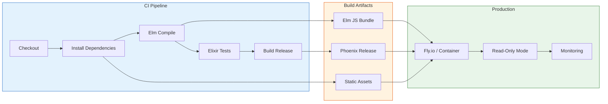

# Phase 5: Export, CI/CD & Production Deployment

> **ARCHITECTURE NOTE:** This phase adds **Elm compilation** to the build pipeline. The production release includes the compiled Elm JavaScript bundle. Deployment remains a Phoenix release with static asset serving.

------------------------------------------------------------------------

## Phase 5 Objective

Phase 5 finalizes the ontology documentation platform for **production
readiness**. Its purpose is to deliver:

1. Robust ontology export capabilities (TTL, JSON)
2. Semantic versioning and release metadata
3. Continuous integration with **Elm compilation** and automated validation
4. Secure, scalable, read-only production deployment
5. Long-term ontology evolution & governance support

------------------------------------------------------------------------

## Architecture Context



------------------------------------------------------------------------

## Section 5.1 --- Ontology Export & Distribution System

This section implements all **machine-readable and human-readable
ontology distribution mechanisms**.

### Task 5.1.1 --- Raw Ontology Download

- [ ] 5.1.1.1 Expose per-ontology Turtle (`.ttl`) download endpoint
- [ ] 5.1.1.2 Validate correct content-type headers (`text/turtle`)
- [ ] 5.1.1.3 Preserve original namespace prefixes
- [ ] 5.1.1.4 Add Content-Disposition headers for download

### Task 5.1.2 --- Merged Ontology Export

- [ ] 5.1.2.1 Merge all imported ontologies into single graph
- [ ] 5.1.2.2 Export merged ontology as Turtle
- [ ] 5.1.2.3 Maintain import provenance metadata
- [ ] 5.1.2.4 Add export endpoint `/export/merged.ttl`

### Task 5.1.3 --- JSON Export for Visualization APIs

- [ ] 5.1.3.1 Export class graph as JSON (nodes, edges)
- [ ] 5.1.3.2 Export property relations as JSON
- [ ] 5.1.3.3 Export individuals as JSON
- [ ] 5.1.3.4 Add export endpoints `/export/*.json`

### Task 5.1.4 --- TripleStore Export

- [ ] 5.1.4.1 Use `TripleStore.export/2` for N-Triples output
- [ ] 5.1.4.2 Use `TripleStore.export/2` for Turtle output
- [ ] 5.1.4.3 Support named-graph export (quads)
- [ ] 5.1.4.4 Add export streaming for large ontologies

### Task 5.1.99 --- Unit Tests: Ontology Export

- [ ] 5.1.99.1 Individual ontology download works
- [ ] 5.1.99.2 Merged ontology exports correctly
- [ ] 5.1.99.3 JSON exports are schema-valid
- [ ] 5.1.99.4 Content-Type headers are correct

------------------------------------------------------------------------

## Section 5.2 --- Versioning, Metadata & Release Management

This section establishes **semantic versioning, ontology metadata
publication, and reproducible release packaging**.

### Task 5.2.1 --- Ontology Version Tracking

- [ ] 5.2.1.1 Extract `owl:versionIRI` metadata
- [ ] 5.2.1.2 Display ontology version in UI footer
- [ ] 5.2.1.3 Preserve historical version metadata
- [ ] 5.2.1.4 Add version to CloudEvents metadata

### Task 5.2.2 --- Documentation Release Tagging

- [ ] 5.2.2.1 Tag documentation builds by ontology version
- [ ] 5.2.2.2 Generate release manifest (JSON)
- [ ] 5.2.2.3 Include Elm build hash in manifest
- [ ] 5.2.2.4 Include TripleStore stats in manifest

### Task 5.2.3 --- Release Metadata Endpoint

- [ ] 5.2.3.1 Create `/api/metadata` endpoint
- [ ] 5.2.3.2 Return ontology versions
- [ ] 5.2.3.3 Return build information
- [ ] 5.2.3.4 Return export capabilities

### Task 5.2.99 --- Unit Tests: Versioning

- [ ] 5.2.99.1 Version metadata renders correctly
- [ ] 5.2.99.2 Release tags resolve correctly
- [ ] 5.2.99.3 Metadata endpoint returns valid JSON

------------------------------------------------------------------------

## Section 5.3 --- CI Pipeline & Automated Validation

This section defines the **continuous integration workflow** with Elm
compilation, automated ontology validation, documentation testing, and
deployment readiness.

### Task 5.3.1 --- Ontology Validation Pipeline

- [ ] 5.3.1.1 Validate syntax of all `.ttl` sources
- [ ] 5.3.1.2 Validate import closure completeness
- [ ] 5.3.1.3 Validate graph sanity (cycles, orphan classes)
- [ ] 5.3.1.4 Run SPARQL query validation

### Task 5.3.2 --- Elm Compilation & Testing

- [ ] 5.3.2.1 Compile Elm application (`elm make`)
- [ ] 5.3.2.2 Run Elm tests (`elm-test`)
- [ ] 5.3.2.3 Verify Elm compilation output
- [ ] 5.3.2.4 Optimize Elm bundle size

### Task 5.3.3 --- Elixir Testing

- [ ] 5.3.3.1 Run all unit tests (`mix test`)
- [ ] 5.3.3.2 Run all integration tests
- [ ] 5.3.3.3 Generate test coverage report
- [ ] 5.3.3.4 Run Credo for code quality

### Task 5.3.4 --- UI Build Validation

- [ ] 5.3.4.1 Verify Elm JS bundle is generated
- [ ] 5.3.4.2 Verify static assets are compiled
- [ ] 5.3.4.3 Test SPA routing
- [ ] 5.3.4.4 Verify CloudEvents type consistency

### Task 5.3.5 --- GitHub Actions CI Integration

- [ ] 5.3.5.1 Create `.github/workflows/ci.yml`
- [ ] 5.3.5.2 Configure Elixir setup (OTP/Elixir versions)
- [ ] 5.3.5.3 Configure Elm setup
- [ ] 5.3.5.4 Configure caching for dependencies
- [ ] 5.3.5.5 PR validation gating

### Task 5.3.99 --- Unit Tests: CI Validation

- [ ] 5.3.99.1 Ontology validation failures block CI
- [ ] 5.3.99.2 Elm compilation failures block CI
- [ ] 5.3.99.3 UI test failures block CI

------------------------------------------------------------------------

## Section 5.4 --- Production Build Configuration

This section configures the **production build** with Elm compilation
and Phoenix release.

### Task 5.4.1 --- Elm Production Build

- [ ] 5.4.1.1 Configure `elm make` for production (`--optimize`)
- [ ] 5.4.1.2 Output to `priv/static/js/elm.js`
- [ ] 5.4.1.3 Add source maps for debugging
- [ ] 5.4.1.4 Configure Elm asset fingerprinting

### Task 5.4.2 --- Mix Configuration for Production

- [ ] 5.4.2.1 Configure `config/prod.exs`
- [ ] 5.4.2.2 Set environment variables (PORT, HOST, SECRET_KEY_BASE)
- [ ] 5.4.2.3 Configure static asset compression
- [ ] 5.4.2.4 Configure CDN for static assets (optional)

### Task 5.4.3 --- Phoenix Release Configuration

- [ ] 5.4.3.1 Configure `mix release` settings
- [ ] 5.4.3.2 Include Elm JS bundle in release
- [ ] 5.4.3.3 Configure cookie signing salts
- [ ] 5.4.3.4 Configure SSL settings

### Task 5.4.4 --- Build Script

- [ ] 5.4.4.1 Create `build.sh` script
- [ ] 5.4.4.2 Build Elm assets
- [ ] 5.4.4.3 Build Phoenix release
- [ ] 5.4.4.4 Generate release checksums

### Task 5.4.99 --- Unit Tests: Build Configuration

- [ ] 5.4.99.1 Production build completes successfully
- [ ] 5.4.99.2 Elm bundle is optimized
- [ ] 5.4.99.3 Release includes all assets

------------------------------------------------------------------------

## Section 5.5 --- Production Deployment Architecture

This section defines the **secure, scalable, read-only production
deployment** of the ontology documentation platform.

### Task 5.5.1 --- Read-Only Public Hosting Mode

- [ ] 5.5.1.1 Disable all write paths
- [ ] 5.5.1.2 Lock ontology ingestion to runtime boot
- [ ] 5.5.1.3 Prevent CloudEvents mutation operations
- [ ] 5.5.1.4 Add read-only mode flag

### Task 5.5.2 --- Deployment Targets

- [ ] 5.5.2.1 Configure Fly.io deployment
- [ ] 5.5.2.2 Configure Docker container (alternative)
- [ ] 5.5.2.3 Configure HTTPS + security headers
- [ ] 5.5.2.4 Configure health check endpoint

### Task 5.5.3 --- Runtime Configuration

- [ ] 5.5.3.1 Configure ontology path (environment variable)
- [ ] 5.5.3.2 Configure TripleStore path
- [ ] 5.5.3.3 Configure web_ui endpoint settings
- [ ] 5.5.3.4 Configure logging level

### Task 5.5.4 --- Static Asset Serving

- [ ] 5.5.4.1 Configure Elm.js serving
- [ ] 5.5.4.2 Configure asset caching headers
- [ ] 5.5.4.3 Configure gzip compression
- [ ] 5.5.4.4 Configure service worker (optional PWA)

### Task 5.5.99 --- Unit Tests: Deployment Safety

- [ ] 5.5.99.1 Write operations are blocked
- [ ] 5.5.99.2 HTTPS is enforced
- [ ] 5.5.99.3 Environment isolation works

------------------------------------------------------------------------

## Section 5.6 --- Monitoring, Logging & Observability

This section establishes **production monitoring and observability**
for both Elixir backend and Elm frontend.

### Task 5.6.1 --- Backend Monitoring

- [ ] 5.6.1.1 Configure Telemetry for Phoenix
- [ ] 5.6.1.2 Track CloudEvents metrics
- [ ] 5.6.1.3 Track Query API performance
- [ ] 5.6.1.4 Track WebSocket connection metrics

### Task 5.6.2 --- Frontend Monitoring

- [ ] 5.6.2.1 Add Elm error tracking
- [ ] 5.6.2.2 Track frontend performance
- [ ] 5.6.2.3 Track CloudEvents round-trip times
- [ ] 5.6.2.4 Track user interactions

### Task 5.6.3 --- Logging

- [ ] 5.6.3.1 Configure structured logging (JSON)
- [ ] 5.6.3.2 Add request ID logging
- [ ] 5.6.3.3 Add CloudEvents logging
- [ ] 5.6.3.4 Configure log rotation

### Task 5.6.99 --- Unit Tests: Monitoring

- [ ] 5.6.99.1 Metrics are collected
- [ ] 5.6.99.2 Errors are logged
- [ ] 5.6.99.3 Performance is tracked

------------------------------------------------------------------------

## Section 5.7 --- Long-Term Maintenance & Evolution Support

This section prepares the platform for **long-term usage, incremental
ontology evolution, and governance processes**.

### Task 5.7.1 --- Ontology Hot-Swap Support

- [ ] 5.7.1.1 Reload ontologies on restart
- [ ] 5.7.1.2 Detect ontology schema drift
- [ ] 5.7.1.3 Validate ontologies on load
- [ ] 5.7.1.4 Rollback on validation failure

### Task 5.7.2 --- Deprecation & Change Tracking

- [ ] 5.7.2.1 Detect `owl:deprecated` entities
- [ ] 5.7.2.2 Render deprecation warnings in UI
- [ ] 5.7.2.3 Track ontology changes across versions
- [ ] 5.7.2.4 Generate change logs

### Task 5.7.3 --- Governance Hooks

- [ ] 5.7.3.1 Export ontology change logs
- [ ] 5.7.3.2 Support external review workflows
- [ ] 5.7.3.3 Add approval metadata
- [ ] 5.7.3.4 Track reviewer assignments

### Task 5.7.99 --- Unit Tests: Maintenance

- [ ] 5.7.99.1 Deprecated entities render correctly
- [ ] 5.7.99.2 Change tracking exports correctly
- [ ] 5.7.99.3 Hot-swap works without downtime

------------------------------------------------------------------------

## Section 5.99 --- Phase 5 Integration Testing

This section validates the **complete production lifecycle** of the
platform --- from ontology ingestion to deployed exploration.

### Task 5.99.1 --- Full End-to-End System Validation

- [ ] 5.99.1.1 Ingest ontology → build docs → deploy
- [ ] 5.99.1.2 Verify all UI layers still function
- [ ] 5.99.1.3 Verify exports work correctly
- [ ] 5.99.1.4 Verify CloudEvents flow correctly

### Task 5.99.2 --- Production Reliability Validation

- [ ] 5.99.2.1 Multi-user concurrent browsing
- [ ] 5.99.2.2 Long-running uptime validation
- [ ] 5.99.2.3 Memory leak detection
- [ ] 5.99.2.4 WebSocket reconnection handling

### Task 5.99.3 --- Deployment Validation

- [ ] 5.99.3.1 Deploy to staging environment
- [ ] 5.99.3.2 Run smoke tests
- [ ] 5.99.3.3 Deploy to production
- [ ] 5.99.3.4 Verify rollback capability

------------------------------------------------------------------------

## Module Structure

### Backend (Elixir)

```
lib/onto_view/
├── web/
│   ├── controllers/
│   │   ├── export_controller.ex      # Ontology export endpoints
│   │   └── metadata_controller.ex    # Release metadata endpoints
│   └── telemetry.ex                  # Monitoring setup
├── release/
│   └── release_tasks.ex              # Custom release tasks
└── governance/
    ├── deprecation.ex                # Deprecation detection
    ├── change_log.ex                 # Change tracking
    └── validation.ex                 # Ontology validation
```

### Build Scripts

```
scripts/
├── build.sh                          # Production build script
├── ci.sh                             # CI pipeline script
└── deploy.sh                         # Deployment script
```

### CI/CD

```
.github/
└── workflows/
    └── ci.yml                        # GitHub Actions pipeline
```

### Frontend (Elm)

```
assets/elm/
├── elm.json                          # Elm package config
├── compile.sh                        # Elm build script
└── tests/                            # Elm tests
```

------------------------------------------------------------------------

## CI Pipeline Example

```yaml
# .github/workflows/ci.yml
name: CI

on: [push, pull_request]

jobs:
  test:
    runs-on: ubuntu-latest

    steps:
      - uses: actions/checkout@v3

      - name: Install Elixir
        uses: erlef/setup-beam@v1
        with:
          otp-version: '27'
          elixir-version: '1.18'

      - name: Install Elm
        run: |
          curl -L -o elm.gz https://github.com/elm/compiler/releases/download/0.19.1/elm-linux-x64.gz
          gunzip elm.gz
          chmod +x elm
          sudo mv elm /usr/local/bin/

      - name: Install dependencies
        run: |
          mix local.rebar --force
          mix deps.get
          (cd assets/elm && elm install)

      - name: Compile Elm
        run: |
          cd assets/elm
          elm make src/Main.elm --optimize=3 --output=../../priv/static/js/elm.js

      - name: Run Elixir tests
        run: mix test

      - name: Run Elm tests
        run: cd assets/elm && elm-test

      - name: Build release
        run: MIX_ENV=prod mix release
```

------------------------------------------------------------------------

## Configuration Files

### config/prod.exs

```elixir
import Config

config :onto_view, OntoView.Endpoint,
  http: [ip: {0, 0, 0, 0}, port: System.get_env("PORT") || 4000],
  url: [host: System.get_env("HOST"), port: 443, scheme: "https"],
  cache_static_manifest: "priv/static/cache_manifest.json",
  server: true,
  root: ".",
  version: Application.spec(:onto_view, :vsn)

config :onto_view, :ontology,
  path: System.get_env("ONTOLOGY_PATH") || "priv/ontologies",
  read_only: System.get_env("READ_ONLY") != "false"

config :logger, level: :info
```

### elm.json

```json
{
  "type": "application",
  "source-directories": ["src"],
  "elm-version": "0.19.1",
  "dependencies": {
    "direct": {
      "elm/browser": "1.0.2",
      "elm/core": "1.0.5",
      "elm/html": "1.0.0",
      "elm/http": "2.0.0",
      "elm/json": "1.1.3",
      "elm/url": "1.0.0",
      "elm/websocket": "1.0.5"
    },
    "indirect": {
      "elm/bytes": "1.0.8",
      "elm/file": "1.0.5",
      "elm/time": "1.0.0",
      "elm/virtual-dom": "1.0.3"
    }
  },
  "test-dependencies": {
    "direct": {
      "elm-explorations/test": "2.1.0"
    },
    "indirect": {
      "elm/random": "1.0.0"
    }
  }
}
```

------------------------------------------------------------------------

*Phase 5 planning complete. All phases updated for web_ui + CloudEvents architecture.*
